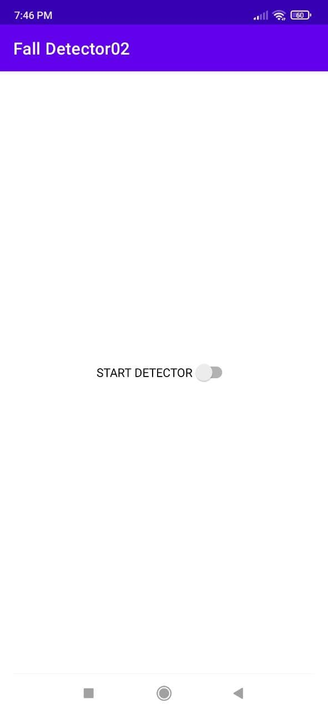
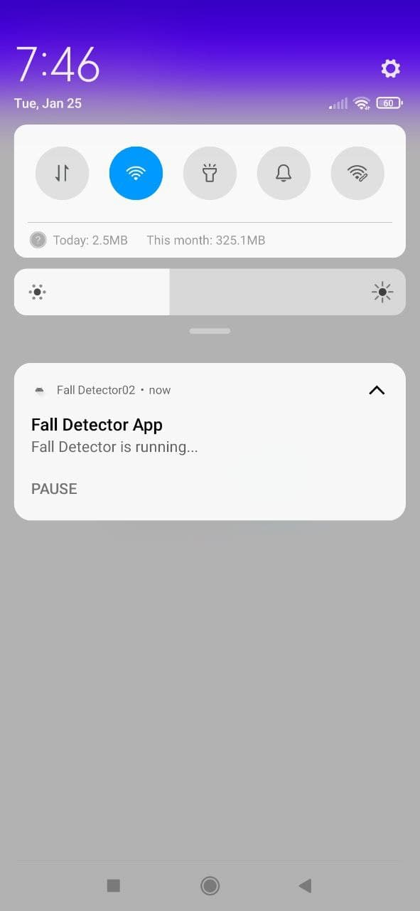
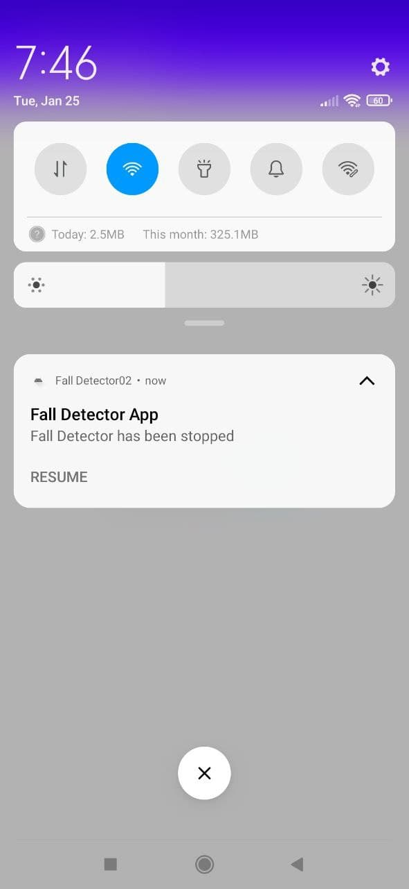
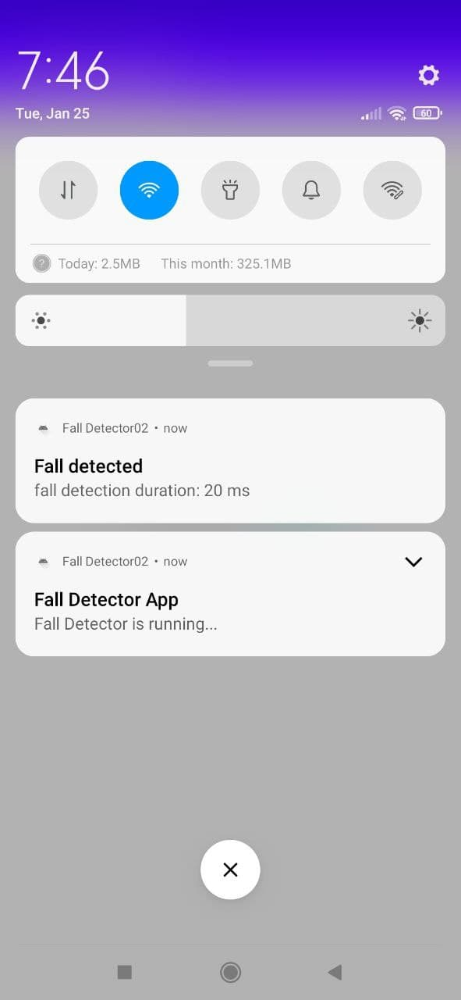

# Fall Detector

## Developed by mahdi razzaghi ghaleh

#### Fall detector, an app which notify you when your phone fell 

## Give a Star! ⭐
If you like or are using this project to learn or start your solution, please give it a star. Thanks!

| Main | When detector service started | when detector stopped |when detector detect falling |
| :---: | :---: | :---: | :---: |
|  |   |  | |

### What tech and component has been used for this?
**Services**  
**Sensors** 

### What is Services?
A Service is an application component that can perform long-running operations in the background.
It does not provide a user interface. 
Once started, a service might continue running for some time, even after the user switches to another application. 
Additionally, a component can bind to a service to interact with it and even perform interprocess communication (IPC).
For example, a service can handle network transactions, play music, perform file I/O, or interact with a content provider, all from the background.

#### Types of Services:
**Foreground**  
**Background**  
**Bound**  

#### Foreground
A foreground service performs some operation that is noticeable to the user. 
For example, an audio app would use a foreground service to play an audio track. 
Foreground services must display a Notification. 
Foreground services continue running even when the user isn't interacting with the app.
When you use a foreground service, you must display a notification so that users are actively aware that the service is running. 
This notification cannot be dismissed unless the service is either stopped or removed from the foreground.

#### Background
A background service performs an operation that isn't directly noticed by the user. 
For example, if an app used a service to compact its storage, that would usually be a background service.

#### Bound
A service is bound when an application component binds to it by calling bindService(). 
A bound service offers a client-server interface that allows components to interact with the service, send requests, 
receive results, and even do so across processes with interprocess communication (IPC). 
A bound service runs only as long as another application component is bound to it. 
Multiple components can bind to the service at once, but when all of them unbind, the service is destroyed.

### LifecycleService Or Service?
LifecycleService has additional functionality,
so it's preferred if you need that functionality.
A LifecycleOwner allows other classes to subscribe to its lifecycle state.
For example, some component in your application could automatically tear itself down,
free up native memory, unregister listeners, etc. by subscribing to the Service's destroyed lifecycle stage.
Then your Service code wouldn't have to worry about it.
You also have access to lifecycleScope in a LifecycleService,
and that can be used to start coroutines that will automatically be cancelled when the Service is stopped.
ViewModel and LiveData are designed around the use of lifecycles,
so you could theoretically use them with a LifecycleService,
but that would probably be counter-productive since they are intended for UI.

